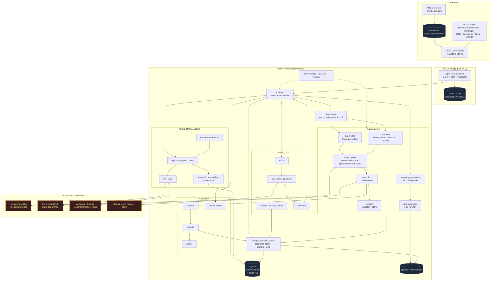
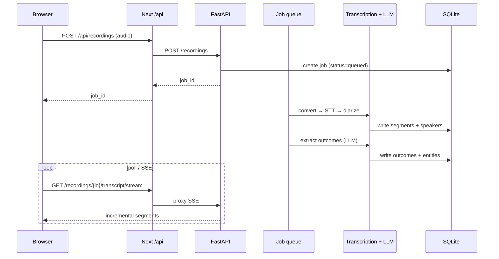
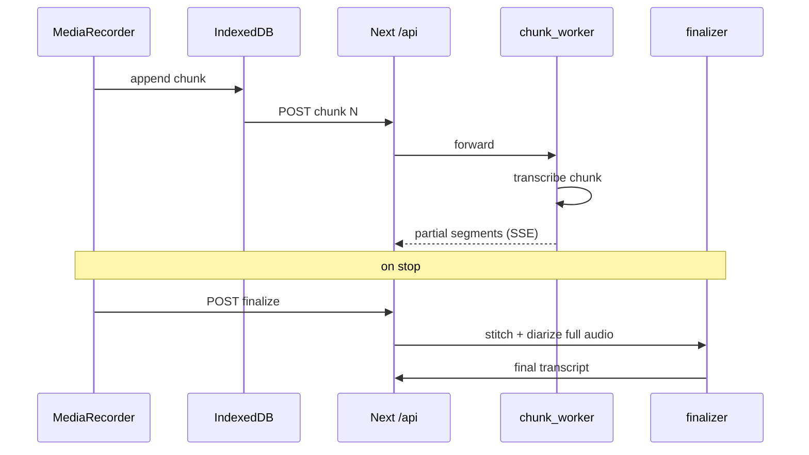
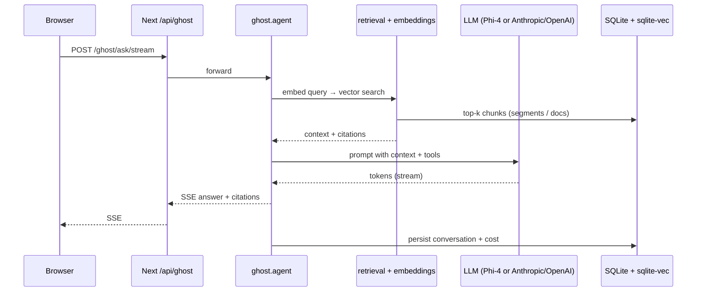
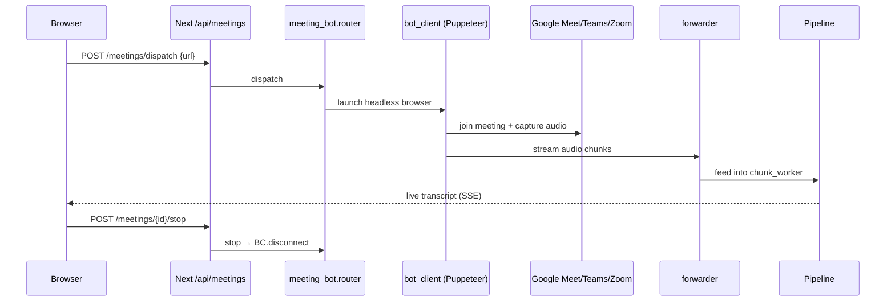

# Architecture

Allure AI is a two-tier app: a **Next.js 16 frontend** that owns UI + a thin proxy/persistence layer, and a **FastAPI Python backend** that owns the ML pipeline (transcription, diarization, extraction, RAG). Browser code never talks to the backend directly — every backend call is proxied through Next.js API routes so the backend can stay on an internal Docker network.

## Component diagram

## Request flows

### 1. Upload → transcript → outcomes

### 2. Chunked / streaming upload (long recordings)

### 3. Ghost (RAG) ask

### 4. Meeting bot

## Data stores

| Store | Owner | Purpose |
|---|---|---|
| `backend/data/allure.db` | FastAPI | Source of truth: jobs, segments, outcomes, entities, projects, ghost convos, autonomy runs. Uses `sqlite-vec` for embeddings. |
| `backend/uploads/` | FastAPI | Original audio + uploaded reference docs (PDF/DOCX). |
| `public/recordings/` | Next.js | Streamable audio served back to the browser. |
| `src/lib/db/*` (better-sqlite3) | Next.js server | Lightweight cache / local-only frontend state. |
| Browser IndexedDB | Browser | In-flight recording chunks for crash-safe resume. |

## External services

- **Hugging Face Hub** — one-time download of Moonshine STT, SpeechBrain diarization, and embedding models. Token via `HF_TOKEN`.
- **Local LLM** — Phi-4-mini GGUF via `llama-cpp-python` (CPU by default; `LLM_GPU` to switch).
- **Anthropic / OpenAI** (optional) — Ghost can be pointed at a hosted provider via `/ghost/settings`; keys live encrypted in the DB.
- **Meeting platforms** — Google Meet / Teams / Zoom joined via the Puppeteer-based meeting bot.

## Build & deploy

- **Frontend** (`Dockerfile`) — Node 20 Alpine, Next.js `output: 'standalone'`, ships with `better-sqlite3` native module and the `schema.sql` for runtime DB init.
- **Backend** (`backend/Dockerfile`) — Python 3.11 slim + ffmpeg + libsndfile. Installs CPU-only PyTorch first to skip the ~2.5 GB CUDA wheels, then builds `llama-cpp-python` with `GGML_CUDA=OFF`.
- **Compose** (`docker-compose.yml`) — exposes frontend on `:3000`, keeps backend on the internal network, mounts three volumes: `frontend-data` (audio), `backend-data` (SQLite), `backend-uploads` (reference docs).

## Observability

`observability.py` emits structured events + per-step timers; `log_store.py` persists them; `metrics.py` exposes counters. The UI consumes `/logs` and `/metrics` (proxied via `/api/logs`) for the admin/settings views.
